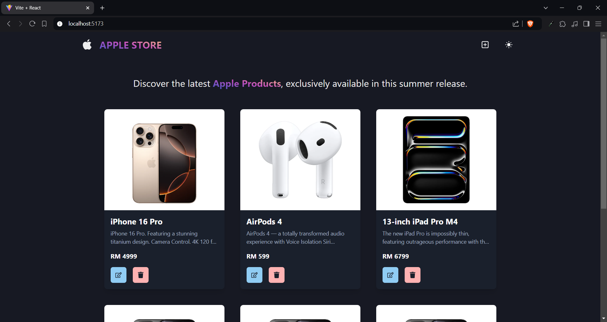
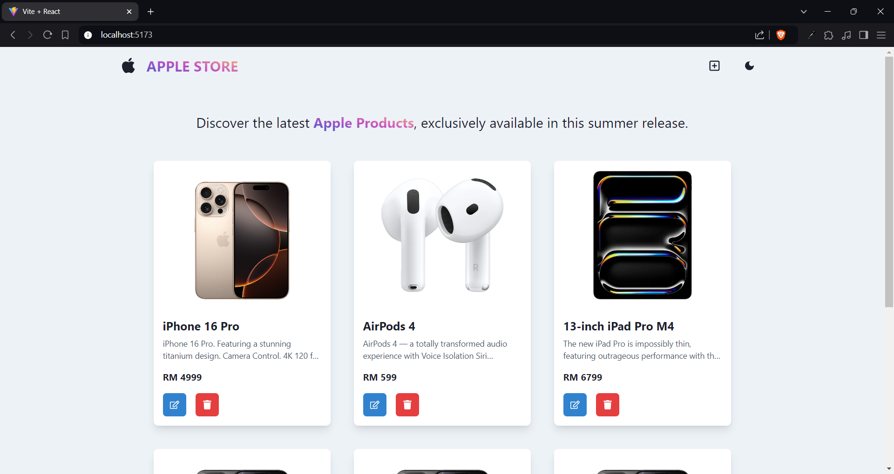
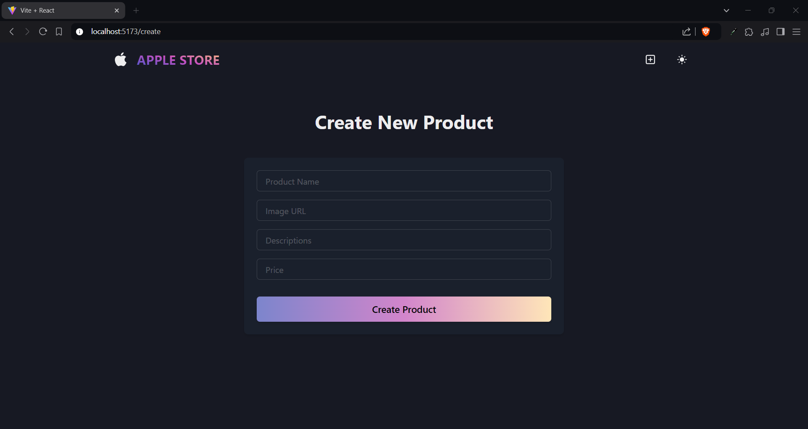
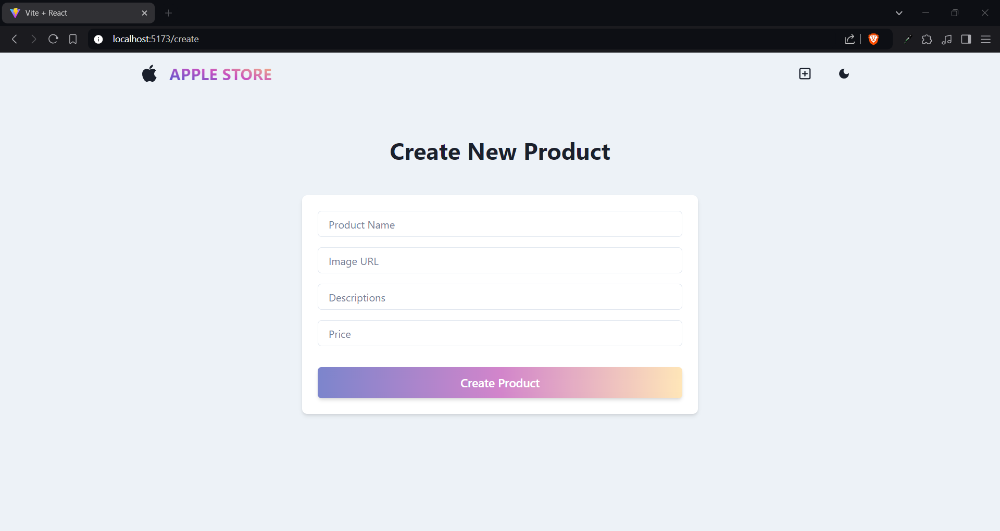
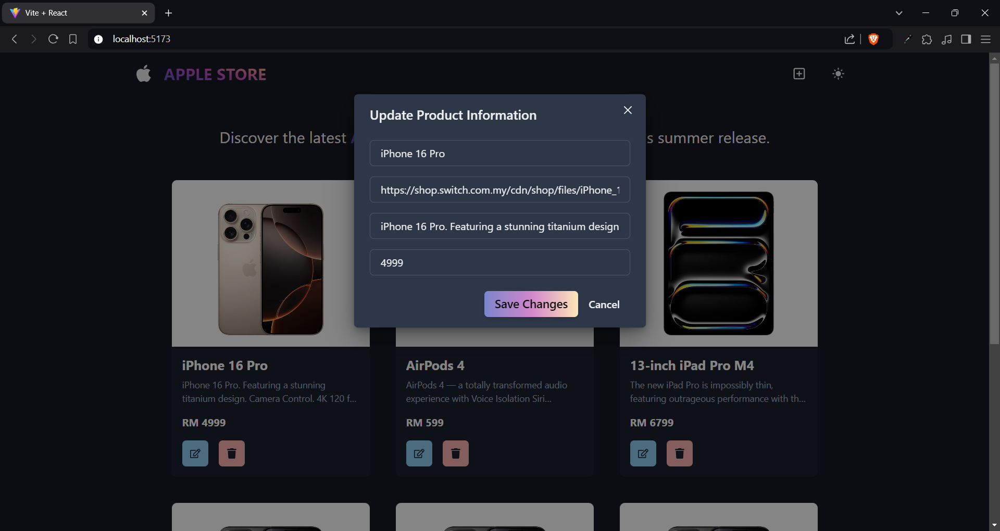
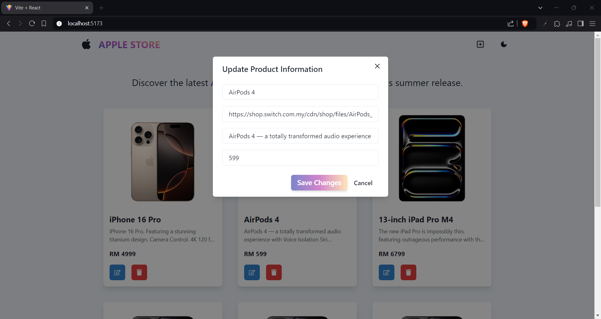

# MERN Product Listing Application

This project is a full-stack web application for managing product listings using the MERN stack (MongoDB, Express.js, React.js, Node.js).

## Screenshots

Here are some screenshots of the web application:

### Homepage & Product Card



### Create Product Page



### Update Product Popup




## Features

- Create, Read, Update, and Delete (CRUD) operations for products
- Responsive frontend built with React and Chakra UI
- State management using Zustand
- RESTful API backend with Express.js
- MongoDB integration for data persistence

## Prerequisites

Before you begin, ensure you have met the following requirements:

- Node.js installed (v14 or later recommended)
- MongoDB Atlas account or local MongoDB installation
- npm or yarn package manager

## Installation

1. Clone the repository:
   ```bash
   git clone https://github.com/yx-elite/mern-product-listing.git
   cd mern-product-listing
   ```

2. Install backend dependencies:
   ```bash
   npm install
   ```

3. Install frontend dependencies:
   ```bash
   cd frontend
   npm install
   ```

4. Create a `.env` file in the root directory and add your MongoDB connection string and port:
   ```bash
   MONGO_URI=your_mongodb_connection_string
   PORT=5000
   ```

## Usage

To start the development servers:

1. In the root directory, start the backend server:
   ```bash
   npm run dev
   ```

2. In a new terminal, navigate to the frontend directory and start the React development server:
   ```bash
   cd frontend
   npm run dev
   ```

The backend server will start running at `http://localhost:5000` by default, or on the port specified in your .env file.
The frontend development server will start and provide you with a local URL (typically `http://localhost:5173`).

## Frontend Structure

The frontend is built with React and uses the following main components:

- `App.jsx`: Main component that sets up routing and overall layout
- `HomePage.jsx`: Displays the list of products
- `CreatePage.jsx`: Provides a form to create new products
- `ProductCard.jsx`: Renders individual product cards with update and delete functionality
- `Navbar.jsx`: Navigation component

State management is handled by Zustand, with the main store defined in `store/product.js`.

## Backend API Endpoints

- **GET /api/products**: Retrieve all products
- **POST /api/products**: Create a new product
- **PUT /api/products/:id**: Update a product by ID
- **DELETE /api/products/:id**: Delete a product by ID

## Technologies Used

- Frontend:
  - React
  - Chakra UI
  - Zustand
  - React Router
  - Vite (as build tool)

- Backend:
  - Node.js
  - Express.js
  - MongoDB with Mongoose
  - dotenv for environment variables

## Contributing

Contributions to improve the application are welcome. Please follow these steps:

1. Fork the repository
2. Create a new branch (`git checkout -b feature/AmazingFeature`)
3. Commit your changes (`git commit -m 'Add some AmazingFeature'`)
4. Push to the branch (`git push origin feature/AmazingFeature`)
5. Open a Pull Request

## License

This project is open source and available under the [MIT License](LICENSE).
